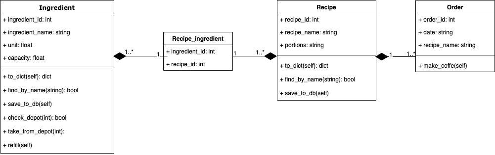

# Coffee Machine Simulation



## Assumptions

I assume that this coffe machine is build-in one (not stand alone on the table).
It gives us more convenience and possibilities. For example you dont need to put
coffee capsules every time you want to drink coffee. Every ingredient such as water, milk, coffee ect has it's own slot in depot. This solution give as option for adding new recipes in the future (if someone want to add his favorite coffee recipe).

But for the purpose of this project its contains only widely known coffee's recipe.
To meet these assumptions i decided to create 3 classes for this project.

- Ingredient - it contains only nessesary attributes
  - name (eg water, milk, coffee, chocolade)
  - unit - this is smallest unit of ingredient that could be use in recipe
  - capacity - this is a max capacity for each ingredient (their tank) in the machine

- Recipe 
  - name (eg. espresso, latte, americana ...)
  - portions - this is a string that represents how many portion of the ingredient unit needs to be used to make a chosen drink

Order class is added for the measurement purpose. Probably machine could work without it but it's very important to know how often people drink specifc drinks.
It's separates action from the recipe itself.


## Running

Firstly you should have docker on your computer. It is the only program you will need to run this application. No need to install Postgres or even Python(if you wanna to run tests / restart database -> Python should be installed).

### First Run
or if it is something wrong with your local database or you wanna to restart app (clean data in database) you should:

```bash
# clone repository
$ git clone https://gitlab.polidea.com/hiring-tasks/kacper-knaz-python-coffee-machine.git  
$ cd kacper-knaz-python-coffee-machine

# make a directory for database
$ mkdir database

# go to docker directory
$ cd docker

# make sure that you shutdown your containers - not for first run
$ docker-compose down 
  
# run only database container 
$ docker-compose up -d db
# after that wait 10sec
  
# run recreation command
$ python3 -c "from app import recreate_db; recreate_db()"
  
# feed db default data
$ python3 -c "from app import seed_db; seed_db()"

# run the app
$ docker-compose up -d --build flaskapp
```

### To run app
```bash  
# start application
$ cd docker 
$ docker-compose up -d  
  
# stop application
$ docker-compose down
```


## How it works

There is one docker-compose file containing two docker images. First one is the Postgres image that allows as to store all the data from coffe machine in local machine. The second one is the image created from separated dockerfile. This is the one that contain the web app including all logic and static files required for running the app. This image will get updated frequently as you make changes to this flask app.


## Testing

To run tests you need to:
1. start database docker image  
   ```bash
   # run command
   docker-compose up -d my_db
   ```
2. Run pytest command in /tests directory
   ```
   pytest -s -v
   ```

I know that tests may show a lot of warnings. But for now I dont know how to solve this.
Despite that all tests passed successfully